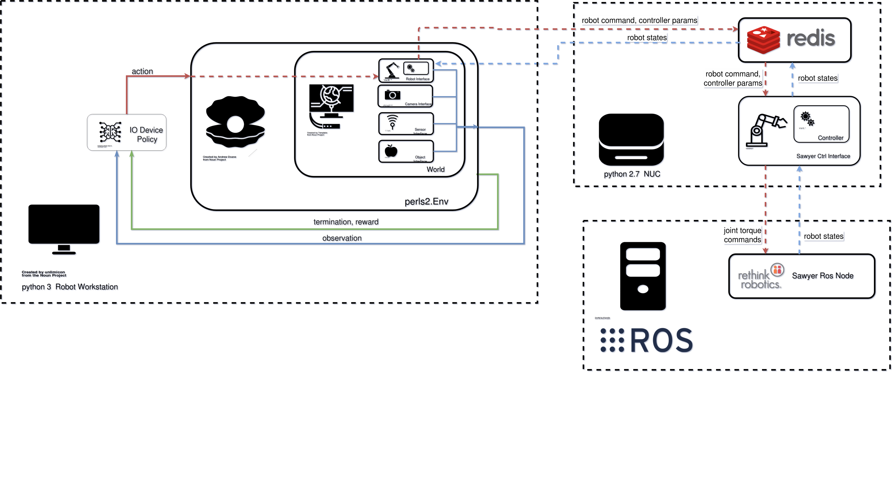

# Real Robot Control

One of the main goals of perls2 is to make it easier to work with real robots. Currently SVL has two types of robotic arms, the Rethink Sawyer Arm and the Franka Emika Panda.

## Using Real Robots

To set up a test for real robots, perls2 provides several bash scripts. These scripts set up the environments and run the necessary for processes for running real robot control.

### Instructions for using the Sawyer Arms.
The following instructions use tmux to create multiple windows in the same terminal.

From the workstation:

1. Open a terminal
2. ssh into the nuc
```bash
    ssh [user_name]@[nuc_id]
```
3. Make sure you have the E-STOP ready.
4. Run the following commands:
```bash
    cd ~/perls2;
    ./scripts/nuc_control.sh
```
The robot should move to the reset position.

5. Open a new terminal.
6. Run the following commands:
```bash
    cd ~/perls2
    ./scripts/ws_control.sh
```

7. Open a new terminal.
8. Source your perls2 env and run your code!

## Torque control.

Torque control for real robots requires fast control frequencies (500Hz - 1kHz) for stability. Because of this, we use a separate computer other than the work station for sending these torque commands to the robot. This computer (a NUC) has nothing else running, which reduces latency for the control loop.

## Rethink Sawyer Infrastructure

To use the Rethink Sawyer arms, we have to use ROS-kinetic. Unfortunately ROS-kinetic only works with python 2.7, which has been outdated for some time. To overcome this limitation, we use Redis, an in-memory database to communicate between the process running on the workstation and the process sending torque commands the sawyer that runs on the NUC.


